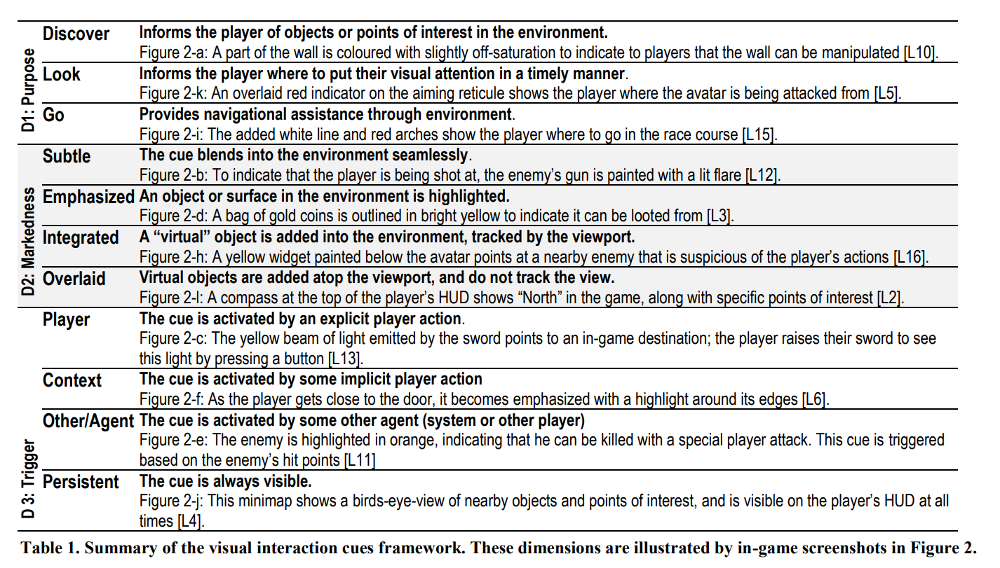
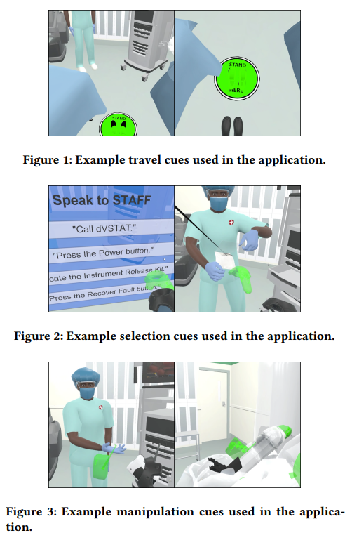
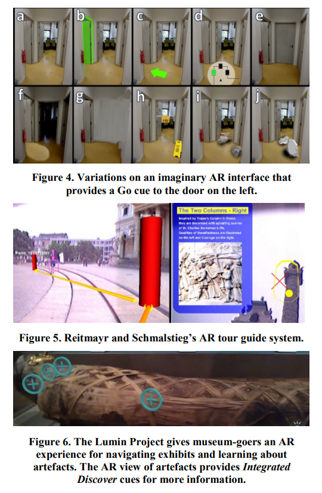

# Sooraj

1. [https://www.hci.uni-wuerzburg.de/projects/getit/](https://www.hci.uni-wuerzburg.de/projects/getit/)
2. [https://downloads.hci.informatik.uni-wuerzburg.de/2018-sui-comp-of-vr-transition-techniques-preprint.pdf](https://downloads.hci.informatik.uni-wuerzburg.de/2018-sui-comp-of-vr-transition-techniques-preprint.pdf)

# Buse

1. http://hcitang.org/papers/2018-chi2018-visual-interaction-cues.pdf
2. https://sci-hub.hkvisa.net/10.1145/3385959.3418448

   CUE TYPES:

originally defined three purposes for interaction cues based on their ludography: discover, look, and go.

**Discover cues (travel)**: inform the user of objects or points of interest in the environment.

**Look cues**: inform the user where to put their visual attention.

**Go cues**: provide navigational assistance

Four additional purposes for interaction cues: pick, manipulate, gesture, and speak.

**Pick cues (selection)**: inform the user to select a particular object or element.

**Manipulate cues (manipulation)**: inform the user to move an object to a new position.

**Gesture cues:** inform the user to perform specific movements with their body.

**Speak cues**: inform the user to verbally communicate.

# Rahul

**There are main two plugin to that we can use to develop the video streaming (Display player view on supervisor)**

[1. Plugin 1(Unity official plugin)](https://docs.unity3d.com/Packages/com.unity.renderstreaming@2.0/manual/index.html)

[2. Plugin 2(Thrid party paid plugin)](https://assetstore.unity.com/packages/templates/packs/fmetp-stream-v2-202537#description)

My opinion would be to use the Unity's official plugin but if ViA VR already using some other plugin it would be better if we use that.

# Kerem

1. We can follow this basic photon tutorial during our next meeting to create a basic online setting: [https://doc.photonengine.com/en-us/pun/v2/demos-and-tutorials/pun-basics-tutorial/intro]()
