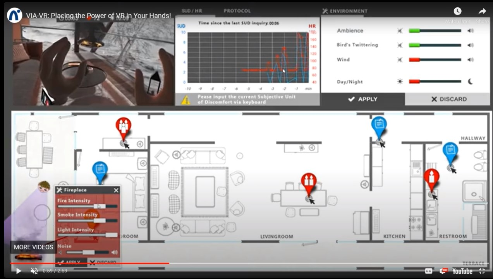

# Meeting Notes

## Installing Packages

- What exactly does Package Registry install? Does this install every package like **'Quest System'** and **'Photon Utils'** right away as soon as we do what is there in the example or should we follow the same procedure for each subproject we need to install them seperately?
- http://hci.uni-wuerzburg.de/topics/20220503-viavr-questionnaire-tool/

## Where and how to develop

- Regarding the the video that is mentioned:

  - Which Git repo? Should we not make a branch out of there rather than starting from an empty project.
  - Can we get an .exe build of ViaVR to examine.

We need to get all the available materials to start developing as soon as possible in order not to lose cruical time.

- It would be better if Sooraj is also a GitLab contributor in the project, if he agrees.

- Are all the possible object models that the user can interact with pre-defined in the scene (and simply hidden/unhidden)
